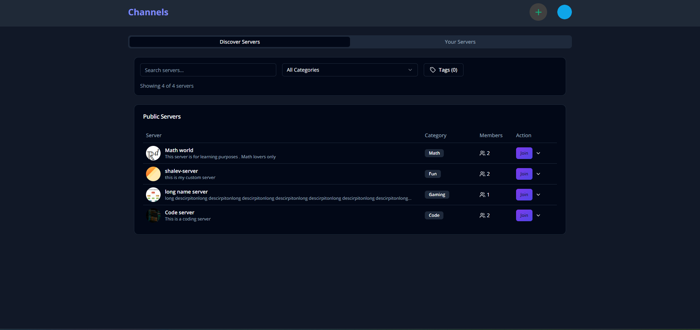

# Channels - Real-time Communication Platform

A full-featured Discord-inspired platform built with Next.js 14 and TypeScript, featuring real-time text, voice, and video chat capabilities.

## Live Demo

Experience Channels in action:

- 🌐 [Live Demo](https://channels-livid.vercel.app/)

---

## Features

- **Real-time Communication**
- Text chat with file sharing
- Voice and video calls using WebRTC
- Direct messaging between users
- Typing indicators
- Message editing and deletion

- **Server Management**
- Public/private servers with categories and tags
- Custom invite system
- Role-based access control (Admin, Moderator, Guest)
- Channel management (Text, Audio, Video)

- **Authentication & Security**
- Email verification
- Password reset functionality
- Two-factor authentication (2FA)
- Rate limiting
- Error handling and logging

- **Additional Features**
- Server discovery system
- Dark/Light mode
- Responsive design
- Real-time presence indicators
- File upload support
- Message history

## Tech Stack

- **Frontend**: Next.js 14, TypeScript, TailwindCSS, shadcn/ui
- **Backend**: Custom WebSocket server (Node.js), LiveKit
- **Database**: PostgreSQL with Prisma ORM
- **Real-time**: WebSocket, WebRTC
- **Authentication**: NextAuth.js, Email verification
- **Testing**: Jest, Playwright

## Contributing

Contributions are welcome! Please feel free to submit a Pull Request.

## License

Distributed under the MIT License.

## Contact

Shalev Asor

- 📧 Email: shalevasor@gmail.com
- 💼 LinkedIn: [linkedin.com/in/shalev-asor](https://linkedin.com/in/shalev-asor)
- 🌐 GitHub: [github.com/ShalevAsor](https://github.com/ShalevAsor)

Project Link: [https://github.com/ShalevAsor/channels](https://github.com/ShalevAsor/channels)
